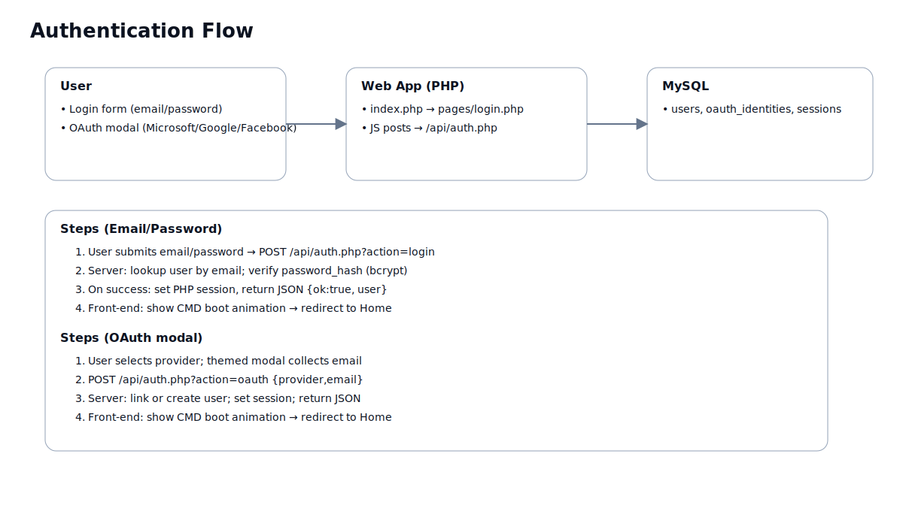
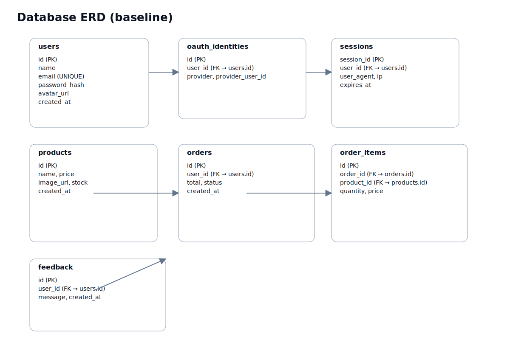

# Fitness Club Web Application — Technical Report

## Cover Page

**Project**: Fitness Club Web Application  
**Team**: <Fill names/IDs>  
**Date**: <Insert date>  
**Repository**: https://github.com/Sachitha101/test  

---

## 1. Executive Summary
This report documents the Fitness Club web application built with PHP, MySQL, and modern JavaScript. It covers architecture, technology stack, API and page structure, database schema, authentication flow, and team contributions. The application runs under XAMPP/Apache, supports light/dark themes, and provides a modern, Fluent-inspired UI.

## 2. GitHub
- Repository: https://github.com/Sachitha101/test  
- Default branch: master  
- Local project root: `htdocs/fitness_win11`

Key files:
- Entry and routing: `fitness_win11/index.php`
- Includes: `fitness_win11/includes/header.php`, `fitness_win11/includes/init.php`, `fitness_win11/includes/footer.php`
- API: `fitness_win11/api/auth.php`, `account.php`, `feedback.php`, `oauth.php`
- Pages: `fitness_win11/pages/*.php` (home, login, create_account, shop, checkout, etc.)
- Front-end JS: `fitness_win11/assets/js/*.js`
- Styles: `fitness_win11/assets/styles.css`
- DB SQL: `fitness_win11/sql/database.sql`
- Tools: `fitness_win11/tools/*.php`

## 3. Technology Stack
- Server: Apache (XAMPP), PHP 8.x
- Database: MySQL (InnoDB, utf8mb4)
- PHP: PDO, sessions, prepared statements, password_hash/password_verify
- Front-end: Vanilla JS modules (app.js, login.js, create_account.js, cart.js, checkout.js)
- CSS: Variables, light/dark theme via `:root.dark`, glassmorphism
- Security: CSRF tokens, prepared statements, session hardening, password hashing
- UX: CMD-style boot animations for login/signup/checkout
- Dev tools: `tools/setup_database.php`, `tools/test_db.php`, `tools/test_auth_flow.php`

## 4. System Architecture


- Client: Responsive PHP-rendered pages with JS interactivity and fetch calls.
- Server: `index.php` routes to pages and includes header/footer; API endpoints in `/api` return JSON and handle auth, account, feedback, etc.
- Data: MySQL stores users, sessions, products, orders, feedback, etc.

## 5. Authentication Flow


- Email/Password: POST `/api/auth.php?action=login`; verify bcrypt hash; set session; on success show CMD animation and redirect to Home.
- Sign-up: POST `/api/auth.php?action=signup`; on success show CMD animation and redirect to Login.
- OAuth (simulated locally): Provider modal collects email; POST `/api/auth.php?action=oauth`; on success show CMD animation and redirect.

## 6. Database Schema


Baseline entities (verify with live export):
- users (id, name, email, password_hash, avatar_url, created_at)
- sessions (session_id, user_id, user_agent, ip, expires_at)
- products (id, name, price, image_url, stock, created_at)
- orders (id, user_id, total, status, created_at)
- order_items (id, order_id, product_id, quantity, price)
- feedback (id, user_id, message, created_at)
- oauth_identities (id, user_id, provider, provider_user_id)

> To paste the exact live schema, run: `php tools/export_schema.php > data/schema.md` and insert its content below.

### 6.1 Live Schema (paste here)
```
<schema.md content here>
```

## 7. Back-end Code Highlights

### 7.1 PHP: Login (email/password) — `/api/auth.php`
```php
// Verify user and start session
$stmt = $pdo->prepare('SELECT id, name, email, password FROM users WHERE email = ?');
$stmt->execute([$email]);
$user = $stmt->fetch(PDO::FETCH_ASSOC);
if ($user && password_verify($password, $user['password'])) {
    $_SESSION['user_id'] = $user['id'];
    $_SESSION['user_name'] = $user['name'];
    echo json_encode(['success' => true]);
} else {
    echo json_encode(['success' => false, 'message' => 'Invalid credentials']);
}
```

### 7.2 PHP: Signup — `/api/auth.php`
```php
$stmt = $pdo->prepare('INSERT INTO users (name, email, password) VALUES (?, ?, ?)');
$stmt->execute([$name, $email, password_hash($password, PASSWORD_DEFAULT)]);
```

### 7.3 PHP: DB Connection — `config/config.php`
```php
function connectDB() {
  $dsn = 'mysql:host=' . DB_HOST . ';dbname=' . DB_NAME . ';charset=utf8mb4';
  $pdo = new PDO($dsn, DB_USER, DB_PASS, [
    PDO::ATTR_ERRMODE => PDO::ERRMODE_EXCEPTION,
    PDO::ATTR_DEFAULT_FETCH_MODE => PDO::FETCH_ASSOC,
  ]);
  return $pdo;
}
```

## 8. Front-end Code Highlights

### 8.1 Login: CMD boot animation trigger — `pages/login.php`
```js
startAuthBoot('Fitness Club • Secure Sign-In', [
  'Initializing secure channel…',
  'Verifying credentials…',
  'Negotiating session keys…',
  'Syncing preferences…',
  'Finalizing session…'
], 'index.php?page=home');
```

### 8.2 OAuth modal (themed) — `pages/login.php`/`pages/create_account.php`
```js
function openOauthEmailModal(provider){
  __oauthProvider = provider;
  // prefill email, show modal, then POST /api/auth.php?action=oauth
}
```

### 8.3 Checkout Secure CMD animation — `pages/checkout.php`
```js
startSecurePaymentBoot('Fitness Club • Secure Payment', [
  'Initializing payment gateway…',
  'Encrypting payload (AES-256)…',
  'Authorizing transaction…',
  'Finalizing order…'
], () => window.location.href = 'index.php?page=confirmation');
```

## 9. Contributions

| Student ID | Name | Role/Area | Key Contributions |
|---|---|---|---|
|  |  | Backend (Auth/API) | Implemented /api/auth.php login/signup, sessions, password hashing |
|  |  | Front-end (UI/Theme) | Light/dark theme, Fluent glass UI, navigation, notifications |
|  |  | Database/Tools | setup_database.php, migrations, schema export, ERD |
|  |  | Shop/Checkout | Cart, snackbars, secure checkout CMD animation |

## 10. Appendix A — Live schema
Paste the contents of `data/schema.md` here.

## 11. Appendix B — Screenshots
Add screenshots of Login, Create Account, Shop, Checkout.
