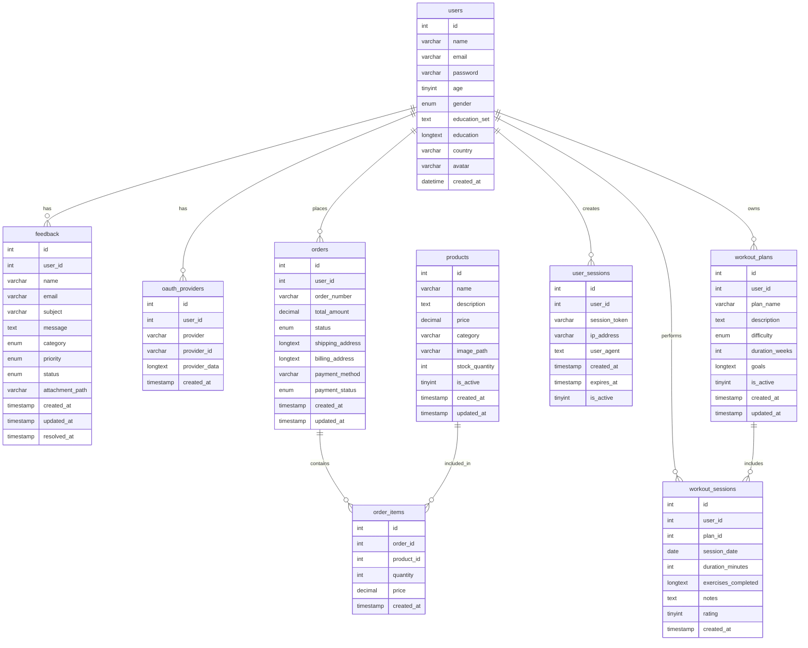

# Database: fitness_db

## Table: feedback

| Column | Type | Null | Default | Key | Extra |
|-------|------|------|---------|-----|-------|
| id | int(11) | NO | - | PRI | auto_increment |
| user_id | int(11) | YES | NULL | MUL | - |
| name | varchar(100) | YES | NULL | - | - |
| email | varchar(100) | YES | NULL | - | - |
| subject | varchar(200) | NO | - | - | - |
| message | text | NO | - | - | - |
| category | enum('general','technical','billing','feature_request','bug_report') | YES | 'general' | - | - |
| priority | enum('low','medium','high','urgent') | YES | 'medium' | - | - |
| status | enum('new','in_progress','resolved','closed') | YES | 'new' | - | - |
| attachment_path | varchar(255) | YES | NULL | - | - |
| created_at | timestamp | NO | current_timestamp() | - | - |
| updated_at | timestamp | NO | current_timestamp() | - | on update current_timestamp() |
| resolved_at | timestamp | YES | NULL | - | - |

## Table: oauth_providers

| Column | Type | Null | Default | Key | Extra |
|-------|------|------|---------|-----|-------|
| id | int(11) | NO | - | PRI | auto_increment |
| user_id | int(11) | NO | - | MUL | - |
| provider | varchar(64) | NO | - | MUL | - |
| provider_id | varchar(191) | NO | - | - | - |
| provider_data | longtext | YES | NULL | - | - |
| created_at | timestamp | NO | current_timestamp() | - | - |

## Table: orders

| Column | Type | Null | Default | Key | Extra |
|-------|------|------|---------|-----|-------|
| id | int(11) | NO | - | PRI | auto_increment |
| user_id | int(11) | NO | - | MUL | - |
| order_number | varchar(50) | NO | - | UNI | - |
| total_amount | decimal(10,2) | NO | - | - | - |
| status | enum('pending','processing','shipped','delivered','cancelled') | YES | 'pending' | - | - |
| shipping_address | longtext | YES | NULL | - | - |
| billing_address | longtext | YES | NULL | - | - |
| payment_method | varchar(50) | YES | NULL | - | - |
| payment_status | enum('pending','paid','failed','refunded') | YES | 'pending' | - | - |
| created_at | timestamp | NO | current_timestamp() | - | - |
| updated_at | timestamp | NO | current_timestamp() | - | on update current_timestamp() |

## Table: order_items

| Column | Type | Null | Default | Key | Extra |
|-------|------|------|---------|-----|-------|
| id | int(11) | NO | - | PRI | auto_increment |
| order_id | int(11) | NO | - | MUL | - |
| product_id | int(11) | NO | - | MUL | - |
| quantity | int(11) | NO | - | - | - |
| price | decimal(10,2) | NO | - | - | - |
| created_at | timestamp | NO | current_timestamp() | - | - |

## Table: products

| Column | Type | Null | Default | Key | Extra |
|-------|------|------|---------|-----|-------|
| id | int(11) | NO | - | PRI | auto_increment |
| name | varchar(100) | NO | - | - | - |
| description | text | YES | NULL | - | - |
| price | decimal(10,2) | NO | - | - | - |
| category | varchar(50) | YES | NULL | - | - |
| image_path | varchar(255) | YES | NULL | - | - |
| stock_quantity | int(11) | YES | 0 | - | - |
| is_active | tinyint(1) | YES | 1 | - | - |
| created_at | timestamp | NO | current_timestamp() | - | - |
| updated_at | timestamp | NO | current_timestamp() | - | on update current_timestamp() |

## Table: users

| Column | Type | Null | Default | Key | Extra |
|-------|------|------|---------|-----|-------|
| id | int(11) | NO | - | PRI | auto_increment |
| name | varchar(200) | NO | - | - | - |
| email | varchar(255) | NO | - | UNI | - |
| password | varchar(255) | NO | - | - | - |
| age | tinyint(3) unsigned | YES | NULL | - | - |
| gender | enum('Male','Female','Other') | YES | NULL | - | - |
| education_set | text | YES | NULL | - | - |
| country | varchar(100) | YES | NULL | - | - |
| created_at | datetime | YES | current_timestamp() | - | - |
| education | longtext | YES | NULL | - | - |
| avatar | varchar(255) | YES | NULL | - | - |

## Table: user_sessions

| Column | Type | Null | Default | Key | Extra |
|-------|------|------|---------|-----|-------|
| id | int(11) | NO | - | PRI | auto_increment |
| user_id | int(11) | NO | - | MUL | - |
| session_token | varchar(255) | NO | - | UNI | - |
| ip_address | varchar(45) | YES | NULL | - | - |
| user_agent | text | YES | NULL | - | - |
| created_at | timestamp | NO | current_timestamp() | - | - |
| expires_at | timestamp | NO | (current_timestamp() + interval 24 hour) | MUL | - |
| is_active | tinyint(1) | YES | 1 | - | - |

## Table: workout_plans

| Column | Type | Null | Default | Key | Extra |
|-------|------|------|---------|-----|-------|
| id | int(11) | NO | - | PRI | auto_increment |
| user_id | int(11) | NO | - | MUL | - |
| plan_name | varchar(100) | NO | - | - | - |
| description | text | YES | NULL | - | - |
| difficulty | enum('beginner','intermediate','advanced') | YES | 'beginner' | - | - |
| duration_weeks | int(11) | YES | 4 | - | - |
| goals | longtext | YES | NULL | - | - |
| is_active | tinyint(1) | YES | 1 | - | - |
| created_at | timestamp | NO | current_timestamp() | - | - |
| updated_at | timestamp | NO | current_timestamp() | - | on update current_timestamp() |

## Table: workout_sessions

| Column | Type | Null | Default | Key | Extra |
|-------|------|------|---------|-----|-------|
| id | int(11) | NO | - | PRI | auto_increment |
| user_id | int(11) | NO | - | MUL | - |
| plan_id | int(11) | YES | NULL | MUL | - |
| session_date | date | NO | - | - | - |
| duration_minutes | int(11) | YES | NULL | - | - |
| exercises_completed | longtext | YES | NULL | - | - |
| notes | text | YES | NULL | - | - |
| rating | tinyint(4) | YES | NULL | - | - |
| created_at | timestamp | NO | current_timestamp() | - | - |

## Foreign Keys

| Table | Column | Ref Table | Ref Column | On Update | On Delete | Name |
|------|--------|-----------|------------|-----------|-----------|------|
| feedback | user_id | users | id | RESTRICT | SET NULL | feedback_ibfk_1 |
| oauth_providers | user_id | users | id | RESTRICT | CASCADE | oauth_providers_ibfk_1 |
| orders | user_id | users | id | RESTRICT | CASCADE | orders_ibfk_1 |
| order_items | order_id | orders | id | RESTRICT | CASCADE | order_items_ibfk_1 |
| order_items | product_id | products | id | RESTRICT | CASCADE | order_items_ibfk_2 |
| user_sessions | user_id | users | id | RESTRICT | CASCADE | user_sessions_ibfk_1 |
| workout_plans | user_id | users | id | RESTRICT | CASCADE | workout_plans_ibfk_1 |
| workout_sessions | plan_id | workout_plans | id | RESTRICT | SET NULL | workout_sessions_ibfk_2 |
| workout_sessions | user_id | users | id | RESTRICT | CASCADE | workout_sessions_ibfk_1 |

---

## Visual diagrams

> These diagrams reflect the current tables exactly. The first is a Mermaid ER diagram that renders in VS Code/GitHub markdown preview. The second mirrors the existing Graphviz DOT in `data/erd.dot`.

### Relationship diagram (Mermaid)



### Graphviz reference

- Source: `data/erd.dot` (already in the repo)
- You can render it with Graphviz if needed:

```powershell
# Optional (requires Graphviz installed):
dot -Tpng data/erd.dot -o data/erd.png
```

---

## Example SQL queries

The following MySQL queries demonstrate common operations using the existing schema. Use prepared statements in application code to avoid SQL injection. These examples assume the database name `fitness_db`.

### Users and auth

```sql
-- 1) Create a user (password should be hashed in app code)
INSERT INTO users (name, email, password, age, gender, country)
VALUES (?, ?, ?, ?, ?, ?);

-- 2) Find user by email
SELECT id, name, email, password, avatar
FROM users
WHERE email = ?;

-- 3) Attach an OAuth provider to a user
INSERT INTO oauth_providers (user_id, provider, provider_id, provider_data)
VALUES (?, ?, ?, JSON_OBJECT('raw', ?));

-- 4) List users with count of linked OAuth providers
SELECT u.id, u.name, u.email, COUNT(op.id) AS oauth_count
FROM users u
LEFT JOIN oauth_providers op ON op.user_id = u.id
GROUP BY u.id, u.name, u.email
ORDER BY u.id DESC
LIMIT 50;

-- 5) Manage sessions: create, clean up expired, and list active
INSERT INTO user_sessions (user_id, session_token, ip_address, user_agent, expires_at)
VALUES (?, ?, ?, ?, DATE_ADD(CURRENT_TIMESTAMP, INTERVAL 24 HOUR));

DELETE FROM user_sessions WHERE expires_at < CURRENT_TIMESTAMP;

SELECT id, user_id, session_token, expires_at
FROM user_sessions
WHERE user_id = ? AND is_active = 1 AND expires_at > CURRENT_TIMESTAMP;
```

### Products and shop

```sql
-- 1) Create a product
INSERT INTO products (name, description, price, category, image_path, stock_quantity, is_active)
VALUES (?, ?, ?, ?, ?, ?, 1);

-- 2) Browse active products with optional category filter
SELECT id, name, price, category, image_path, stock_quantity
FROM products
WHERE is_active = 1 AND (? IS NULL OR category = ?)
ORDER BY created_at DESC
LIMIT 50;

-- 3) Search products by name/description
SELECT id, name, price, category
FROM products
WHERE is_active = 1
  AND (name LIKE CONCAT('%', ?, '%') OR description LIKE CONCAT('%', ?, '%'))
ORDER BY name ASC
LIMIT 100;

-- 4) Top selling products (by quantity)
SELECT p.id, p.name, SUM(oi.quantity) AS total_qty
FROM order_items oi
JOIN products p ON p.id = oi.product_id
GROUP BY p.id, p.name
ORDER BY total_qty DESC
LIMIT 10;
```

### Orders and checkout

```sql
-- 1) Create an order shell (using a generated order_number in app code)
INSERT INTO orders (user_id, order_number, total_amount, status, payment_status)
VALUES (?, ?, 0.00, 'pending', 'pending');

-- 2) Add an item to an order
INSERT INTO order_items (order_id, product_id, quantity, price)
VALUES (?, ?, ?, ?);

-- 3) Update order total from its items
UPDATE orders o
JOIN (
  SELECT order_id, SUM(quantity * price) AS total
  FROM order_items
  WHERE order_id = ?
  GROUP BY order_id
) t ON t.order_id = o.id
SET o.total_amount = t.total,
    o.updated_at = CURRENT_TIMESTAMP
WHERE o.id = ?;

-- 4) Fetch an order summary with items
SELECT o.id, o.order_number, o.total_amount, o.status, o.payment_status,
       o.created_at, p.id AS product_id, p.name AS product_name,
       oi.quantity, oi.price
FROM orders o
JOIN order_items oi ON oi.order_id = o.id
JOIN products p ON p.id = oi.product_id
WHERE o.id = ?;

-- 5) List a user's orders (most recent first)
SELECT id, order_number, total_amount, status, payment_status, created_at
FROM orders
WHERE user_id = ?
ORDER BY created_at DESC
LIMIT 25;
```

### Feedback

```sql
-- 1) Submit feedback (user_id may be NULL for guests)
INSERT INTO feedback (user_id, name, email, subject, message, category, priority, status)
VALUES (?, ?, ?, ?, ?, COALESCE(?, 'general'), COALESCE(?, 'medium'), 'new');

-- 2) List open feedback with newest first
SELECT f.id, f.subject, f.category, f.priority, f.status, f.created_at,
       u.id AS user_id, u.name AS user_name
FROM feedback f
LEFT JOIN users u ON u.id = f.user_id
WHERE f.status IN ('new', 'in_progress')
ORDER BY f.created_at DESC
LIMIT 100;

-- 3) Mark a feedback as resolved
UPDATE feedback
SET status = 'resolved', resolved_at = CURRENT_TIMESTAMP, updated_at = CURRENT_TIMESTAMP
WHERE id = ?;
```

### Workout plans and sessions

```sql
-- 1) Create a workout plan
INSERT INTO workout_plans (user_id, plan_name, description, difficulty, duration_weeks, goals)
VALUES (?, ?, ?, ?, ?, ?);

-- 2) Log a workout session (plan_id is optional)
INSERT INTO workout_sessions (user_id, plan_id, session_date, duration_minutes, exercises_completed, notes, rating)
VALUES (?, ?, ?, ?, ?, ?, ?);

-- 3) Sessions by user in a date range
SELECT ws.id, ws.session_date, ws.duration_minutes, ws.rating, wp.plan_name
FROM workout_sessions ws
LEFT JOIN workout_plans wp ON wp.id = ws.plan_id
WHERE ws.user_id = ? AND ws.session_date BETWEEN ? AND ?
ORDER BY ws.session_date DESC;

-- 4) Weekly summary (total minutes & sessions)
SELECT YEARWEEK(session_date, 1) AS year_week,
       COUNT(*) AS sessions,
       SUM(COALESCE(duration_minutes,0)) AS minutes
FROM workout_sessions
WHERE user_id = ?
GROUP BY YEARWEEK(session_date, 1)
ORDER BY year_week DESC
LIMIT 8;
```

---

Notes:
- Keep using prepared statements and proper transactions around checkout (creating orders and items).
- Maintain indexes on foreign keys and frequently filtered columns (e.g., `user_sessions.expires_at`, `orders.user_id`, `order_items.order_id`).
- The Mermaid diagram is for visualization only and does not change your schema.

